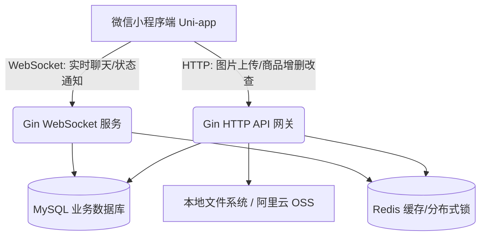

## 1. 核心技术栈 (Tech Stack)
### 1.1 前端应用端 (买家/卖家端)
- **核心框架：** Uni-app (基于 Vue 3 + Vite)
- **UI 组件库：** uView Plus 或 Vant Weapp (AI 生成 UI 的最佳搭档，样式精美且规范)
- **网络请求：** `uni.request` 封装 (对接后端 HTTP API)
- **实时通信：** `uni.connectSocket` (对接后端 WebSocket 实现私聊)
### 1.2 后端服务层 (核心引擎)
- **编程语言：** Golang (1.21+)
- **Web 框架：** Gin (处理极高并发的 HTTP 路由)
- **实时通信网关：** Gorilla WebSocket (处理买卖双方的高并发实时聊天)
- **ORM 框架：** GORM
- **认证机制：** JWT (JSON Web Token)
### 1.3 数据存储与中间件
- **关系型数据库：** MySQL 8.0 (存储用户、物品、聊天记录等核心结构化数据)
- **内存缓存层：** Redis (缓存首页推荐列表、WebSocket 用户在线状态、防刷验证码)
- **文件存储 (图片上传)：**
    - _MVP 阶段：_ 后端本地文件系统存储 (利用 Gin 的静态文件服务暴露 URL)。
    - _进阶阶段 (答辩加分)：_ 接入阿里云 OSS 或七牛云对象存储。
### 1.4 AI 辅助开发工具链
- **主 IDE：** Antigravity IDE (作为 AI Agent 的主要阵地，直接读取整个项目上下文生成代码)
- **代码审查：** GoLand + GitHub Copilot (用于后端复杂业务逻辑、数据库事务的安全检查)
- **架构图绘制：** next-ai-draw-io / Mermaid
## 2. 系统拓扑架构

## 3. 项目目录结构 (Project Layout)
为了配合 Antigravity IDE 的上下文理解，我们将前后端拆分为两个独立的代码仓库（或大目录）：
### 3.1 前端目录 (`qlut-secondhand-app`)
qlut-secondhand-app/
├── pages/
│   ├── index/index.vue       # 首页（瀑布流推荐）
│   ├── item/detail.vue       # 物品详情页（大图轮播、点击“我想要”发起私聊）
│   ├── item/publish.vue      # 发布页（包含 uni.chooseImage 图片上传）
│   └── chat/room.vue         # 聊天室页（WebSocket 实时对话界面）
├── static/                   # 静态图标
├── utils/
│   ├── request.js            # 封装全局 HTTP 请求（自动带上 JWT Token）
│   └── websocket.js          # 封装 WebSocket 重连与心跳机制
└── App.vue                   # 全局应用配置
### 3.2 后端目录 (`qlut-secondhand-api`)
qlut-secondhand-api/
├── cmd/server/main.go        # 启动入口
├── internal/
│   ├── api/                  # 控制器层 (处理入参、校验)
│   ├── service/              # 业务逻辑层
│   ├── model/                # MySQL 表结构定义 (GORM)
│   ├── repository/           # 数据库增删改查操作
│   ├── ws/                   # **新增：WebSocket 连接池与消息分发引擎**
│   └── middleware/           # JWT、跨域、限流拦截器
└── uploads/                  # **新增：用户上传的图片物理存放目录**
## 4. 核心数据模型 (Data Models)
为了支持“闲鱼式”的图片多发和实时聊天，我们需要设计以下核心表（此处展示 Go 语言 GORM 结构定义的大纲）：
### 4.1 `User` (用户表)
- `ID`: uint (主键)
- `StudentID`: string (学号，唯一索引)
- `Avatar`: string (头像 URL)
- `Nickname`: string (昵称)
### 4.2 `Item` (闲置物品表)
- `ID`: uint
- `PublisherID`: uint (卖家 ID)
- `Title`: string (最多 30 字)
- `Content`: text (详细描述)
- `Price`: decimal (预约期望价格)
- `Images`: json (存储图片 URL 数组，如 `["/uploads/1.jpg", "/uploads/2.jpg"]`)
- `Status`: string (`OnSale` 在售, `Pending` 预约交接中, `Completed` 已交接)
### 4.3 `Message` (聊天记录表 - 新增)
- `ID`: uint
- `SenderID`: uint (发送方)
- `ReceiverID`: uint (接收方)
- `ItemID`: uint (关联的具体物品，方便在聊天头部展示“正在沟通的宝贝”)
- `ContentType`: string (`text` 文字, `image` 图片)
- `Content`: text (消息内容或图片 URL)
- `IsRead`: boolean (是否已读)
- `CreatedAt`: timestamp
---
## 5. 关键业务流程与技术难点实现
### 5.1 闲鱼式“多图发布”实现方案
- **前端 (Antigravity Prompt 提示)：** * “请使用 uni-app 和 Vant 的 Uploader 组件实现一个图片选择器，最多允许选择 6 张。选择后调用 `uni.uploadFile` 逐张上传到后端的 `/api/v1/upload` 接口，并接收返回的图片 URL，最后将表单和 URL 数组一起提交给发布接口。”
- **后端 (Gin 处理)：**
    - 接收 `multipart/form-data`。
    - 校验文件后缀 (`.jpg`, `.png`) 和大小 (限制 5MB 内)。
    - 重命名文件（使用 UUID 防止文件名冲突），存入 `./uploads` 文件夹。
    - Gin 开启静态目录路由：`router.StaticFS("/uploads", http.Dir("./uploads"))`，前端即可直接通过域名访问图片。
### 5.2 闲鱼式“实时私聊”实现方案 (WebSocket)
- **痛点：** HTTP 是无状态的，无法实现“对方发消息，我立刻收到”。
- **架构设计：**
    1. 用户打开小程序，通过 Token 建立 WebSocket 连接：`ws://yourdomain/api/v1/ws?token=xxx`。
    2. 后端维护一个全局的 `ClientManager`（哈希映射表：`map[userID]*WebSocketConn`），记录谁在线。
    3. **发送消息：** A 给 B 发消息，A 通过 WS 发送 JSON。后端拦截后，先写入 MySQL 的 `Message` 表落地保存。
    4. **实时推送：** 后端检查 B 是否在线（是否在 `ClientManager` 里）。如果在线，直接通过 B 的 WS 连接将消息推送过去；如果不在线，则仅存库，B 下次登录时通过 HTTP 接口拉取历史未读消息。
### 5.3 应对前端零基础的 AI IDE 开发策略 (Antigravity 最佳实践)
对于前端零基础的开发者，**不要尝试手写布局**。请严格按照以下步骤使用 Antigravity：
1. **喂全局设定：** 在 Antigravity 的系统提示词或 `CursorRules` 里写明：“本项目前端使用 Uni-app (Vue3 `setup` 语法) 开发，UI 库使用 Vant Weapp，所有接口请求使用封装好的 `utils/request.js`。”
2. **切分任务，逐个击破：** 不要说“帮我写个闲鱼”。要细化为单页指令：“请帮我编写 `pages/index/index.vue`，要求上方是一个搜索框，下方是一个两列瀑布流，展示闲置物品的封面图、标题和价格。”
3. **截图纠错反馈流：** 如果 AI 生成的页面按钮歪了，**不要自己去查 CSS**。直接在微信开发者工具里截个图，扔给 Antigravity，说：“‘我想要’按钮偏左了，并且颜色需要改成闲鱼那种明黄色，请修改代码。” AI 会自动调整 Flex 布局并替换代码。